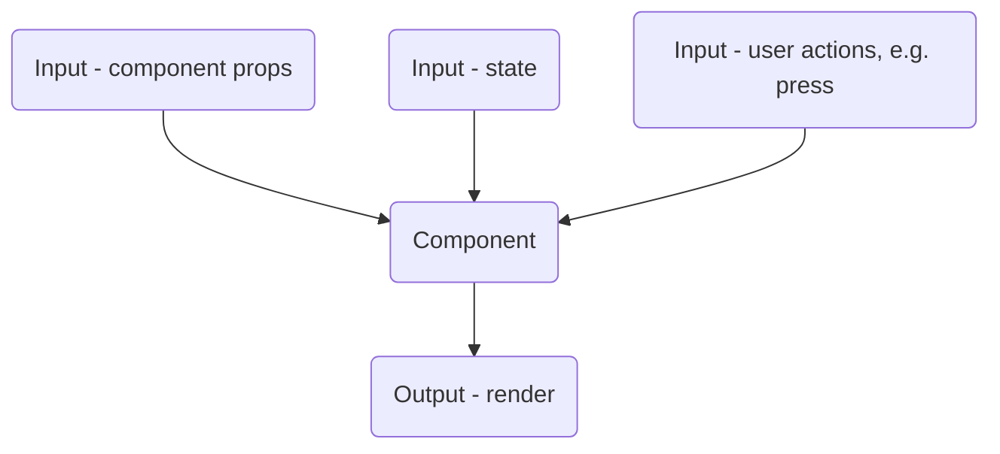

# Components



# Testing React Native Components and Hooks with Jest and React Testing Library

In addition to testing pure functions, React Native developers must also test components and hooks. Just as with pure functions, we can vary the inputs to our components and hooks to ensure that they work correctly. The inputs for components include props, state, and user interaction, and the output is what is rendered on the screen or returned from a callback.

## Testing Components

React Native components take props as input and render some output to the screen. We can test components by creating a mock version of the component and passing in different props as input. We can then use the React Testing Library to check that the output is as expected. We can also simulate user interactions, such as clicking a button, to test that the component behaves correctly.

Consider the following example component:

```js
function MyComponent({ title, onClick }) {
  const [count, setCount] = useState(0);

  const handleClick = () => {
    setCount(count + 1);
    onClick();
  };

  return (
    <View>
      <Text>{title}</Text>
      <Button title={`Clicked ${count} times`} onPress={handleClick} />
    </View>
  );
}
```

To test this component, we can create a test file called `MyComponent.test.js`:

```js
import React from 'react';
import { render, fireEvent } from '@testing-library/react-native';
import MyComponent from './MyComponent';

describe('MyComponent', () => {
  it('should render the title and click count', () => {
    const { getByText } = render(<MyComponent title="My Title" onClick={() => {}} />);
    const titleElement = getByText('My Title');
    expect(titleElement).toBeDefined();

    const buttonElement = getByText('Clicked 0 times');
    expect(buttonElement).toBeDefined();

    fireEvent.press(buttonElement);
    expect(getByText('Clicked 1 times')).toBeDefined();
  });
});
```

Here, we are rendering the `MyComponent` with a mocked `onClick` function and checking that the title and click count are displayed correctly. We then simulate a button press and check that the click count has been updated correctly.

## Testing Hooks

React Native hooks are similar to components in that they take inputs and produce outputs. However, instead of rendering to the screen, hooks modify the state or provide some other functionality to the component.

To test hooks, we can create a mock component that uses the hook and pass in different inputs. We can then check that the output of the hook is as expected.

Consider the following example hook:

```js
function useCounter(initialValue) {
  const [count, setCount] = useState(initialValue);

  const increment = () => setCount(count + 1);

  return { count, increment };
}
```

To test this hook, we can create a mock component and use the hook:

```js
import React from 'react';
import { renderHook } from '@testing-library/react-hooks';
import useCounter from './useCounter';

describe('useCounter', () => {
  it('should return the initial value', () => {
    const { result } = renderHook(() => useCounter(0));
    expect(result.current.count).toBe(0);
  });

  it('should increment the count correctly', () => {
    const { result } = renderHook(() => useCounter(0));
    result.current.increment();
    expect(result.current.count).toBe(1);
    result.current.increment();
    expect(result.current.count).toBe(2);
  });
});
```

Here, we are using the `renderHook` function from React Testing Library to test the `useCounter` hook. We are passing in different input values and checking that the output is as expected.

## Conclusion

Testing React Native components and hooks involves varying the inputs and observing the outputs. For components, we can test props, state, and user interaction, and for hooks, we can test the return value. Jest and React Testing Library provide powerful tools for testing and make it easy to write tests that are reliable and maintainable.