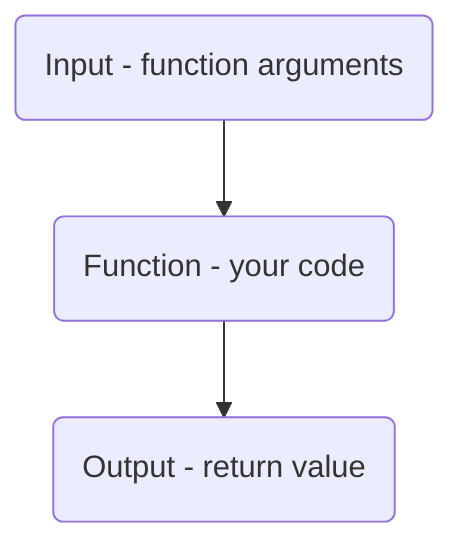

## Pure functions



## What are Pure Functions?

Pure functions are functions that produce the same output when given the same input. They have no side effects, and they do not modify the state or variables outside of their scope. Pure functions are easy to test since they don't have any dependencies or interactions with external systems. In React Native, pure functions are often used as utility functions or as part of a larger component.

## Writing a Simple Pure Function

Consider the following function:

```js
function add(a, b) {
  return a + b;
}
```

This function takes two arguments (`a` and `b`) and returns the sum of those arguments. This is a pure function because it has no side effects and always returns the same output for a given input.

## Testing the Pure Function

To test this function, we can create a test file called `add.test.js`:

```js
import add from './add';

describe('add', () => {
  it('should return the sum of two numbers', () => {
    expect(add(2, 3)).toBe(5);
    expect(add(0, 0)).toBe(0);
    expect(add(-1, 1)).toBe(0);
  });
});
```

Here, we are using Jest's `expect` function to compare the output of our `add` function with the expected result. The `toBe` matcher checks that the output is exactly equal to the expected value.

We can also test for edge cases, such as when the input is `0` or when there are negative numbers.

## Conclusion

Testing pure functions is a great way to get started with unit testing in React Native. By changing the input and observing the output, we can ensure that our functions work as intended. Jest and React Testing Library provide powerful tools for testing and make it easy to write tests that are reliable and
