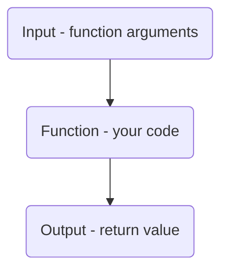
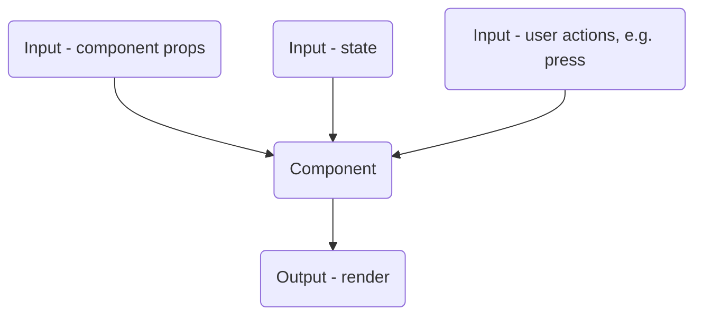
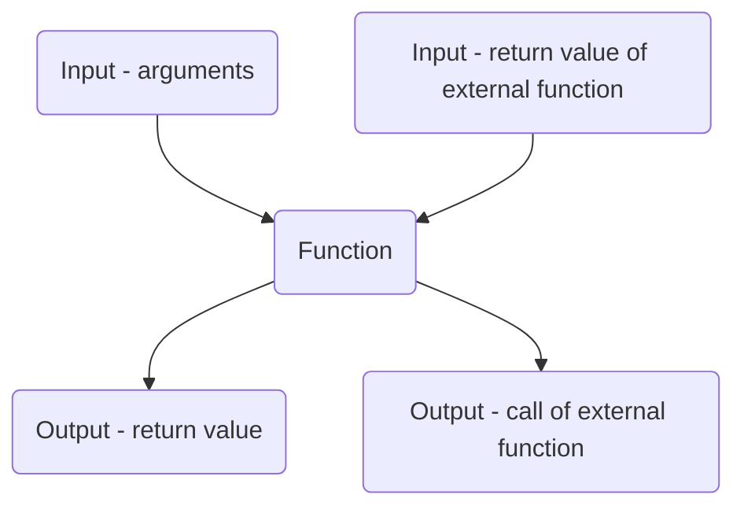

# ReactNative testing

## Pure functions

```mermaid
graph TD
%% Pure funcion
A(Function - your code) --> B(Output - return value)
C(Input - function arguments) --> A
```

## Components

```mermaid
graph TD
%% Simple Component
A(Input - component props) --> B(Component)
B --> C(Output - render)
D(Input - state) --> B
E(Input - user actions, e.g. press) --> B
```

## Side effects - mocking 🤡

```mermaid
graph TD
%% Mocking side effects
A(Input - arguments) --> B(Function)
B --> C(Output - return value)
B --> E(Output - call of external function)
F(Input - return value of external function) --> B
%% B --> D(external function, e.g. API call)
%% D --> B
```
