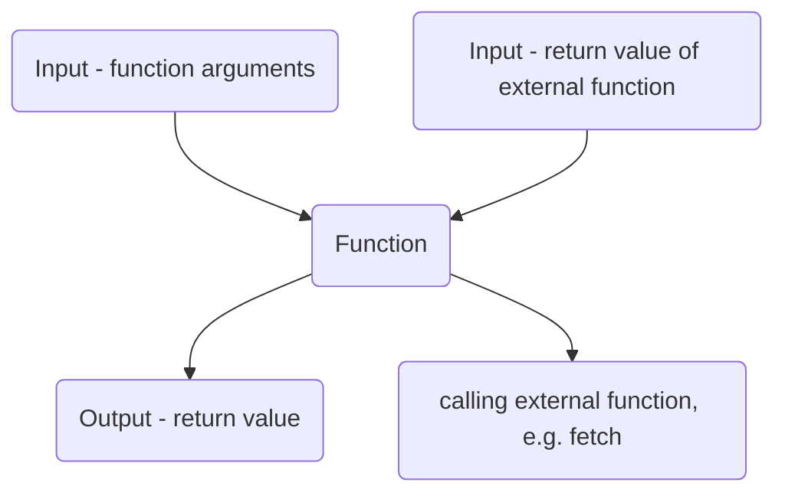

# Side effects - mocking 🤡



# Testing Functions with Side Effects in React Native with Jest and React Testing Library

Functions with side effects are those that modify the state or variables outside of their scope. They are often used to interact with external systems, such as APIs or databases. To test functions with side effects, we need to observe the changes that they make to the state or variables and ensure that they behave as expected.

## Inputs and Outputs of Functions with Side Effects

Functions with side effects have both inputs and outputs. The inputs are the arguments passed to the function, as well as any external state or variables that the function depends on. The outputs are the changes made to the state or variables outside of the function, as well as any return values or callbacks that the function produces.

For example, consider the following function:

```js
function fetchData(url, onSuccess, onError) {
  axios
    .get(url)
    .then(result => onSuccess(result.data))
    .catch(error => onError(error));
}
```

This function takes a URL, as well as two callback functions for success and error cases. It calls an external API using Axios and passes the response data to the `onSuccess` function. If there is an error, it passes the error to the `onError` function.

To test this function, we can mock the `axios.get` function using Jest. We can then call the `fetchData` function with different inputs and observe the output of the callbacks.

```js
import axios from 'axios';
import fetchData from './fetchData';

jest.mock('axios');

describe('fetchData', () => {
  it('should call the onSuccess callback with the response data', async () => {
    const response = {data: {message: 'Hello World'}};
    axios.get.mockResolvedValue(response);

    const onSuccess = jest.fn();
    const onError = jest.fn();

    await fetchData('http://example.com', onSuccess, onError);

    expect(onSuccess).toHaveBeenCalledWith(response.data);
    expect(onError).not.toHaveBeenCalled();
  });

  it('should call the onError callback with the error message', async () => {
    const error = new Error('Network error');
    axios.get.mockRejectedValue(error);

    const onSuccess = jest.fn();
    const onError = jest.fn();

    await fetchData('http://example.com', onSuccess, onError);

    expect(onSuccess).not.toHaveBeenCalled();
    expect(onError).toHaveBeenCalledWith(error);
  });
});
```

Here, we are using Jest's `mockResolvedValue` and `mockRejectedValue` functions to control the output of the `axios.get` function. We are then checking that the `onSuccess` or `onError` callback is called with the correct input.

## Conclusion

Testing functions with side effects requires observing the changes made to the state or variables outside of the function. We can do this by mocking external systems and observing the output of callbacks or return values. Jest and React Testing Library provide powerful tools for testing and make it easy to write tests that are reliable and maintainable.
